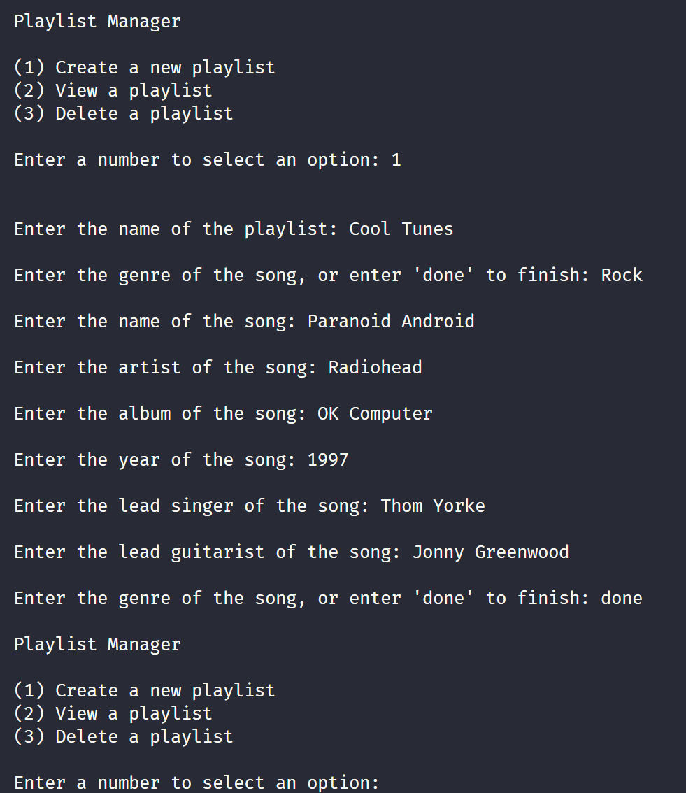
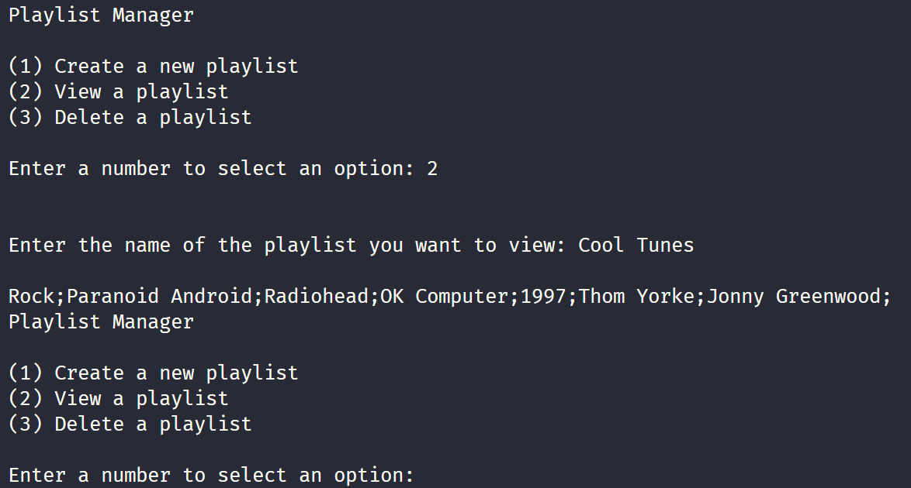
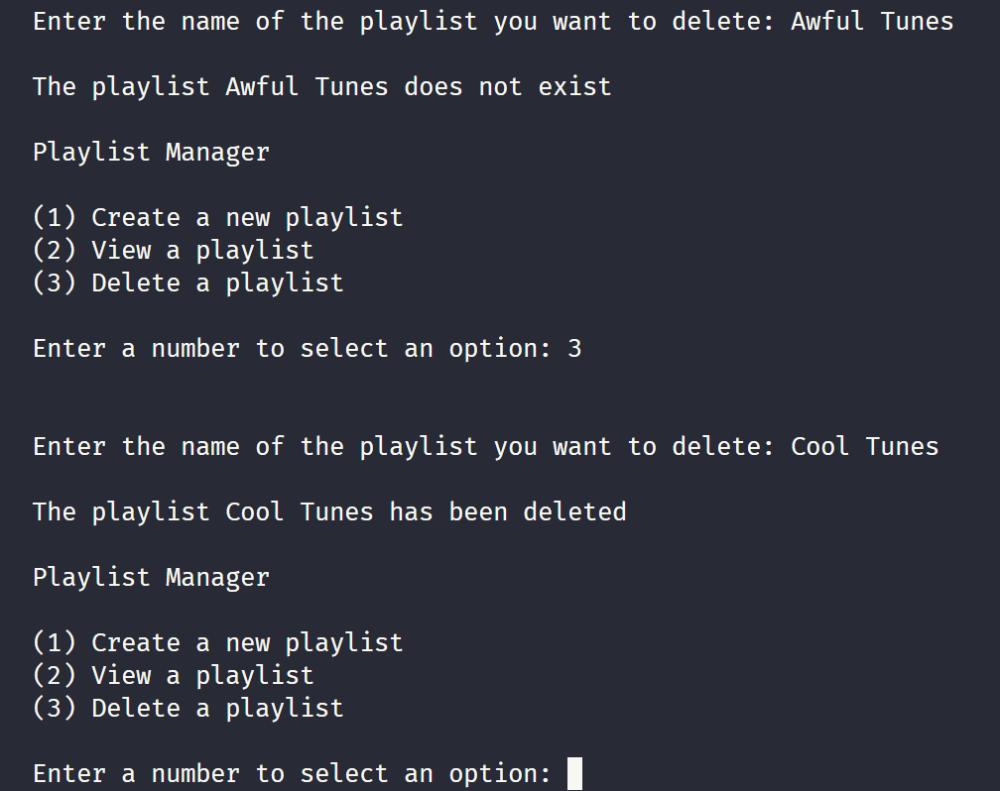

# 1502MidtermPractice

> **Warning**
> This isn't an accurate representation of the midterm. This is my best guess of the types of content that will be on the midterm. I'm not responsible for your midterm mark. That's on you.

## The Problem

This practice problem was designed in a similar fashion to assignments one and two. You're tasked with creating an application that can create, view, or delete playlists. The application should be able to create a playlist and add songs to the playlist. The application should also be able to view all the playlists and view all the songs in a playlist. The application should also be able to delete a playlist.

  
<b>Data Storage</b>

  

Each playlist should be saved in a separate file in the `res/playlists` folder. The file should be named after the playlist. The file should contain the songs in the playlist. Each song should be on a separate line. The song data should be separated by a semicolon (i.e. `;`).
Your program will only need to read a playlist file when requested, and only write to a playlist file when requested. You do not need to keep track of the playlist files in your program.

A [sample playlist](https://open.spotify.com/playlist/1o36aezFZKZ3YBc4K0sIRS?si=8a848e14de4543c7) file is given. It's mine, and it's really good, and you should listen to it. I don't take criticism.

  
<b>Menu Options</b>

  

  
- **Create a Playlist**
  - Allows users to create a playlist and add songs to it.
    - Duplicate playlist names aren't allowed, and you should verify if a name is avaliable before creating the playlist.
    - The user should be able to add as many songs as they want to the playlist. They should be able to enter `done` when they're done adding songs. If the user enters `done` without adding any songs, the playlist should be deleted.
      - The playlist should be saved once the user is done adding songs.
    - The user should be able to add songs to the playlist by entering the corresponding information (in the `song info` tab).
- **Load a Playlist**
  - Allows user to view a playlist. The songs in the playlist should be displayed in the order they appear in the file. After viewing the playlist, the user should be returned to the main menu.
- **Delete a Playlist**
  - Allows user to delete a playlist. The playlist must be a valid playlist. If the playlist doesn't exist, the user should be notified. After deleting the playlist, the user should be returned to the main menu.
- **Exit**
  - Exits the program. You should've saved the playlists in the other steps, so just exit.

Note that all menus should be case in-sensitive, and validate user input.

  
<b>Song Info</b>

  

There are three different types of songs:

- **Rock Songs**

  - Rock songs should have the following information:
    - Genre.
    - Song Name.
    - Artist.
      - If there are multiple artists, they should be separated by a comma (i.e. `,`).
    - Album.
    - Release Year.
    - Lead Singer.
    - Lead Guitarist.

- **Rap Songs**

  - Rap songs should have the following information:
    - Genre.
    - Song Name.
    - Artist.
      - If there are multiple artists, they should be separated by a comma (i.e. `,`).
    - Album.
    - Release Year.
    - Explicit Lyrics.
      - This should be a boolean value.
    - Producer.

- **Electronic Songs**
  - Electronic songs should have the following information:
    - Genre.
    - Song Name.
    - Artist.
      - If there are multiple artists, they should be separated by a comma (i.e. `,`).
    - Album.
    - Release Year.
    - Vocals?
      - This should be a boolean value.
    - Subgenre.
      - Some valid subgenres are: (I) IDM, (A) Alternative, and (B) Breakcore.

  
<b>Sample Output</b>

  

### Add song

### View playlist

### Delete playlist

